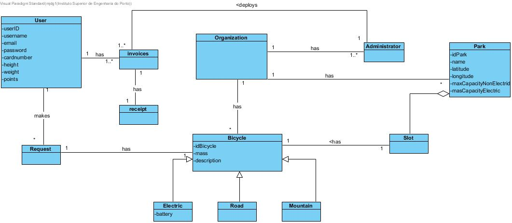
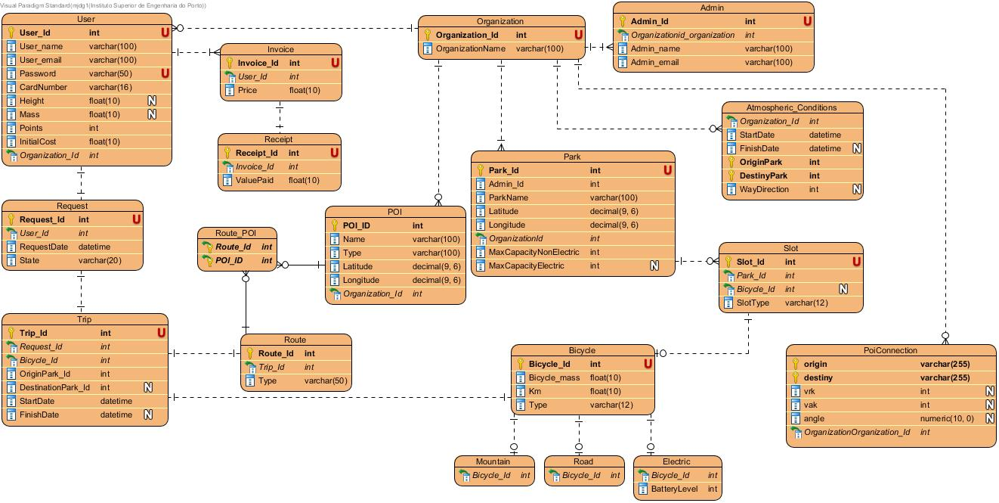

# README #

## Abstract ##
This project was developed for course LAPR3 for the first cycle degree in Computer Engineering.

In this project was developed an application to improve and support companies, in the bicycle sharing business.

With this application the company will be able to manage users, parks and bicycles, as well as manage the picking and return of bicycles to the parks.


## Introduction ##
The goal of this project was to develop an application able to support the bicycle sharing business companies.

The Bicycle Sharing Business is a service in which the bicycles are available to be shared between people, for a short term and for a price.
This Business is responsable to manage the bicycles availables and also the bicycles parks where the bicycles are.
Many Bicycle Sharing Businesses allow people to pick a bicycle at a park and return the bicycle to a different park, that belongs to the same Business Company.
The main goal of this business is to provide free or affordable accesses to bicycles in urban areas as an alternative to other transport vehicles, thus reducing congestion, noise and air pollution.

During three weeks the application for bike sharing business companies, was developed. It was possible to apply concepts of analysis, modelling and object-oriented programming, using Java.

The project was divided in 3 Sprints. It was used Jira issues to create tasks, division of tasks and planning of tasks. Each user story were created, assigned to a team member and with focus on:
  - Analysis, where it was developed the Use Case Diagram and the System Sequence Diagram.
  - Desing, where it was develped the Class Diagram, Sequence Diagram and the Entity-relationship Diagram.
  - Implementation, where code and test code were implemented.
  - Review, where it was possible to review the entire implementation.

The Scrum Master of the project had daily meetings with the team to know the status of each User Story, and at the end of each Sprint the Scrum Master create a sprint retrospective.


## Problem Statement ##
There is a need from a Bicycle Sharing Company, to have a software service and/or application to manage their bicycles, bicycles parks and users.

This company has many bicycle parks at a certain city, that are used to park the several bicycles that the company also owns.
The company have three different bicycle types: road, mountain and eletric.

A person to use and ride one of the company bicycles, at the first time, needs to register and this registration as an cost. Thenceforward, the person is a user of the service and only needs to pay the time that the bicycles is loaned.

To initialize with the bicycle loan, the user must request the application to unlock the bicycle he/she wants (road, mountain or eletric) and the park where the bicycle will be picked.
At the end of the loan, when returning the bicycle to the park, the user will receive a notification stating the correct bicycle lock.

## Solution ##
In this project the team used the scrum agile method to effectively work on the application requested by the client.

The application was developed on Java connected to a sqldeveloper database, to manage the respective business data, such as bicycle requests, parks and user registration.

The Jira platform was used to manage the development of the project and provide information on each user story state.


## Requirements Engineering ##





# Use Cases #

**UC1 - Administrator can add parks to the business.**

- [Use Case Diagram](diagrams/UC1.PNG)

- [SSD](diagrams/SSD-UC1.png)


**UC2 - Administrator can remove parks to the business.**

- [Use Case Diagram](diagrams/UC2.PNG)

- [SSD](diagrams/SSD_UC2.jpg)


**UC4 - Administrator can add bicycles to the business.**

- [Use Case Diagram](diagrams/US4_UseCaseDiagram.png)

- [SSD](diagrams/US4_dSequencia.png)


**UC7 - User can create an user registration.**

- [Use Case Diagram](diagrams/UC7_UCdiagram.jpg)

- [SSD](diagrams/UC7_SSD.jpg)


**UC08 - User Can Login.**

- [Use Case Diagram](diagrams/UC8_UseCaseDiagram.jpg)

- [SSD](diagrams/SSD_UC8_UserCanLogin.jpg)


**UC09 - User can see nearest bicycle parks.**

- [Use Case Diagram](diagrams/UC_09_UCdiagram.jpg)

- [SSD](diagrams/UC_09_SSD.jpg)


**UC10 - User can verify the distance to another park.**

- [Use Case Diagram](diagrams/UC_10_UCdiagram.jpg)

- [SSD](diagrams/UC_10_SSD.jpg)


**UC11-User can request a bicycle unlock at a given park.**

- [Use Case Diagram](diagrams/US11.jpg)

- [SSD](diagrams/US11_SSD.jpg)

**UC12-User can check if a destination park has any free parking places for there current bicycle.**

- [Use Case Diagram](diagrams/UC12_UC.jpg)

- [SSD](diagrams/UC12_SSD.jpg)

**UC15 - System sends an e-mail stating that the bicycle is correctly locked and how long it was taken.**

- [Use Case Diagram](diagrams/UC15_UCDiagram.jpg)

- [SSD](diagrams/UC15_SSD.jpg)


**UC16- Calculate the amount of burned calories.**

- [Use Case Diagram](diagrams/UC16_UseCase.jpg)

- [SSD](diagrams/UC16_SSD.jpg)

**UC17  User returns a bike, the park availability should be updated.**

- [Use Case Diagram](diagrams/UC17_UseCase.jpg)

- [SSD](diagrams/UC17__SSD.jpg)

**UC20  User can choose different routes between parks, when requesting a bike.**

- [Use Case Diagram](diagrams/UC_20_UCdiagram.jpg)

- [SSD](diagrams/UC_20_SSD.jpg)


**UC23 Administrator wants to know bearing wind information.**

- [Use Case Diagram](diagrams/UC23_USECASE_Administrator wants to know bearing wind information.jpg)

- [SSD](diagrams/UC23_SSD_Administrator wants to know bearing wind information.jpg)


# Design #

## Use Cases ##


**UC1 - Administrator can add parks to the business.**

- [Class Diagram](diagrams/UC1_ClassDiagram.jpg)

- [Sequence Diagram](diagrams/SD_UC1.jpg)

- [Entity-Relationship Diagram](diagrams/UC1_ERD.png)


**UC4 - Administrator can add parks to the business.**

- [Class Diagram](diagrams/US4_DC.png)

- [Sequence Diagram](diagrams/US4_SD.png)

- [Entity-Relationship Diagram](diagrams/US4_ERD.jpg)


**UC7 - User can create an user registration.**

- [Class Diagram](diagrams/UC7_CD.jpg)

- [Sequence Diagram](diagrams/UC7_SD.jpg)

- [Entity-Relationship Diagram](diagrams/UC7_ER.jpg)


**UC08 - User Can Login.**

- [Class Diagram](diagrams/UC8_DiagramClasses.jpg)

- [Sequence Diagram](diagrams/UC8_SD.jpg)

- [Entity-Relationship Diagram](diagrams/ER_UC8_UserCanLogin.jpg)


**UC10 - User can verify the distance to another park.**

- [Class Diagram](diagrams/UC_10_ClassDiagram.jpg)

- [Sequence Diagram](diagrams/UC_10_SD.jpg)

- [Entity-Relationship Diagram](diagrams/UC_10_ERD.jpg)


**UC11-User can request a bicycle unlock at a given park.**

- [Class Diagram](diagrams/US11_DC.jpg)

- [Sequence Diagram](diagrams/US11_SD.jpg)

- [Entity-Relationship Diagram](diagrams/US11_ER.jpg)

**UC12-User can check if a destination park has any free parking places for there current bicycle.**

- [Class Diagram](diagrams/UC12_CD.jpg)

- [Sequence Diagram](diagrams/UC12_SD.jpg)

- [Entity-Relationship Diagram](diagrams/ER12.jpg)

**UC15 - System sends an e-mail stating that the bicycle is correctly locked and how long it was taken.**

- [Sequence Diagram](diagrams/UC15_SD.jpg)

- [Class Diagram](diagrams/UC15_UCDiagram.jpg)

- [Entity-Relationship Diagram](diagrams/UC15_ER.jpg)


**UC16- Calculate the amount of burned calories.**

- [Sequence Diagram](diagrams/UC16_SD.jpg)

- [Class Diagram](diagrams/UC16_DiagramaClasses.jpg)

- [Entity-Relationship Diagram](diagrams/UC16_ER.jpg)

**UC17  User returns a bike, the park availability should be updated.**

- [Sequence Diagram](diagrams/UC17_SD.jpg)

- [Class Diagram](diagrams/UC17_DiagramaClasses.jpg)

- [Entity-Relationship Diagram](diagrams/UC17_ER.jpg)


**UC20- User can choose different routes between parks, when requesting a bike.**

- [Sequence Diagram](diagrams/US_20_SD.jpg)

- [Class Diagram](diagrams/UC_20_ClassDiagram.jpg)

- [Entity-Relationship Diagram](diagrams/US_20_ERD.jpg)


## Conclusion ##
The project aims to apply concepts learned during the first part of the semester, namely Applyied Physics, Data Structures and Daba base, through the development of an application that allows, a Bicycle Sharing Company, to manage its bicycles, parks and users. This project was developed in three Sprints.

In the first sprint some basic functions were developed, such as adding parks, bicycles and users to the system. Was also developed other functions, as: possibility to check available bicycles at a certain park, check if a certain park as free slots to park the bicycle, send a email to an user to state that the bicycle is correctly locked, and other.

In the second sprint, it was developed a possibility to suggest interests points to the user that could be visited during the route, and the wind was consider as a factor having information about the average speed between two locations and the wind direcion.

In the last sprint, the interest points suggestion was improved as well as wind information. In this third sprint was also considered several input and output files to aling with the client.

Unfortunately, not all the features discussed with the client were developed. The reasons for this incomplete project were related to technical dificulties and lack of time.


----------------
This is the repository template used for student repositories in LAPR Projets.

#Java source files

Java source and test files are located in folder src.

# Maven files #

Pom.xml file controls the project build.
## Observations
In this file, DO NOT EDIT the following elements:

* groupID
* artifactID
* version
* properties

Also, students can only add dependencies to the specified section on this file.

# Eclipse files #

The following files are solely used by Eclipse IDE:

* .classpath
* .project

# IntelliJ Idea IDE files #

The following folder is solely used by Intellij Idea IDE :

* .idea

## How was the .gitignore file generated? ##
.gitignore file was generated based on https://www.gitignore.io/ with the following keywords:
  - Java
  - Maven
  - Eclipse
  - NetBeans
  - Intellij

## Who do I talk to? ##
In case you have any problem, please email Nuno Bettencourt (nmb@isep.ipp.pt).

## How do I use Maven? ##

### How to run unit tests? ###
Execute the "test" goals.
`$ mvn test`

### How to generate the javadoc for source code? ###
Execute the "javadoc:javadoc" goal.

`$ mvn javadoc:javadoc`

This generates the source code javadoc in folder "target/site/apidocs/index.html".

### How to generate the javadoc for test cases code? ###
Execute the "javadoc:test-javadoc" goal.

`$ mvn javadoc:test-javadoc`

This generates the test cases javadoc in folder "target/site/testapidocs/index.html".

### How to generate Jacoco's Code Coverage Report? ###
Execute the "jacoco:report" goal.

`$ mvn test jacoco:report`

This generates a jacoco code coverage report in folder "target/site/jacoco/index.html".

### How to generate PIT Mutation Code Coverage? ###
Execute the "org.pitest:pitest-maven:mutationCoverage" goal.

`$ mvn test org.pitest:pitest-maven:mutationCoverage`

This generates a PIT Mutation coverage report in folder "target/pit-reports/YYYYMMDDHHMI".

### How to combine different maven goals in one step? ###
You can combine different maven goals in the same command. For example, to locally run your project just like on jenkins, use:

`$ mvn clean test jacoco:report org.pitest:pitest-maven:mutationCoverage`

# Oracle repository

If you get the following error:

```
[ERROR] Failed to execute goal on project
bike-sharing: Could not resolve dependencies for project
lapr3:bike-sharing:jar:1.0-SNAPSHOT:
Failed to collect dependencies at
com.oracle.jdbc:ojdbc7:jar:12.1.0.2:
Failed to read artifact descriptor for
com.oracle.jdbc:ojdbc7:jar:12.1.0.2:
Could not transfer artifact
com.oracle.jdbc:ojdbc7:pom:12.1.0.2
from/to maven.oracle.com (https://maven.oracle.com):
Not authorized , ReasonPhrase:Authorization Required.
-> [Help 1]
```

Follow these steps:

https://blogs.oracle.com/dev2dev/get-oracle-jdbc-drivers-and-ucp-from-oracle-maven-repository-without-ides

You do not need to set a proxy.
